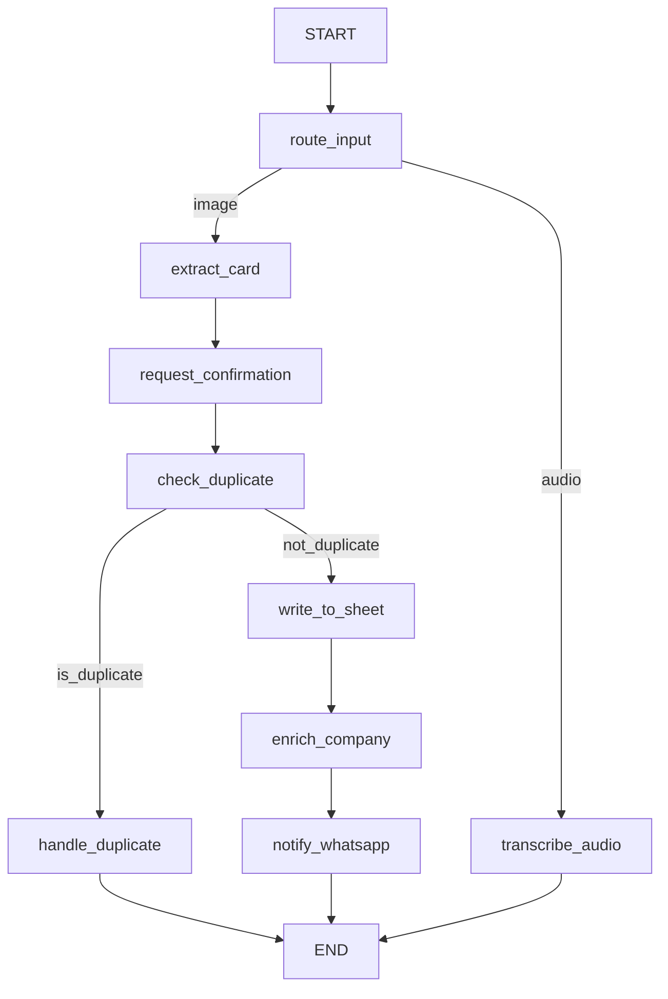

# CardFlow

Visiting Card Digitization & Voice Notes Orchestrator

## Architecture Overview
CardFlow is a full-stack application built with FastAPI, LangGraph, and React. It processes visiting card images, extracts contact details using multimodal LLMs, deduplicates them against Google Sheets, saves them, and notifies a manager via WhatsApp. It also accepts subsequent voice notes in the same chat session and accurately updates the relevant Google Sheet row, showcasing complex LangGraph state orchestration and persistent checkpointers.

### LangGraph State Graph


## Setup Instructions

### Environment Variables
Copy `.env.example` to `.env` and configure:
- `GOOGLE_APPLICATION_CREDENTIALS`: Path to your service account JSON file.
- `GOOGLE_SHEET_ID`: ID of the Google Sheet to write contacts to.
- `MONGO_URI`: MongoDB Atlas connection string.
- `WHATSAPP_TOKEN` / `WHATSAPP_PHONE_NUMBER_ID` / `MANAGER_PHONE_NUMBER`: Meta API credentials.
- `GEMINI_API_KEY`: API key for vision/audio models.

### Local Development
```bash
docker-compose up --build
```
This will start the FastAPI backend on port 8000 and the Vite frontend on port 5173.

## Deployment (Google Cloud Run)
We recommend deploying the backend to Google Cloud Run since it scales to zero and integrates natively with Google service accounts for the Sheets API.

1. Build and push the backend Docker image to Google Container Registry (GCR) or Artifact Registry.
2. Deploy the image to Cloud Run using the `gcloud` CLI:
   ```bash
   gcloud run deploy cardflow-backend --image gcr.io/YOUR_PROJECT/cardflow-backend --platform managed --allow-unauthenticated
   ```
3. Set your environment variables in the Cloud Run Secret Manager and expose them to the service.

## Design Decisions
- **Checkpointer Keying**: The LangGraph state is check-pointed in MongoDB using `thread_id=session_id`. This allows an asynchronous voice note uploaded later to access the exact `active_sheet_row` index saved during the card processing flow.
- **Deduplication Normalization**: Phone numbers are stripped of formatting (e.g. `+91`, `-`) to bare digits, and compared for exact or suffix matches. Emails are lowercased and stripped of whitespace.
- **HITL Interrupt**: We use LangGraph's `interrupt()` feature. The backend pauses execution and surfaces the `raw_extraction` to the UI via a `ConfirmationCard`. Execution only resumes via a dedicated `/confirm` endpoint sending a `Command(resume=data)` object to the graph runner.
