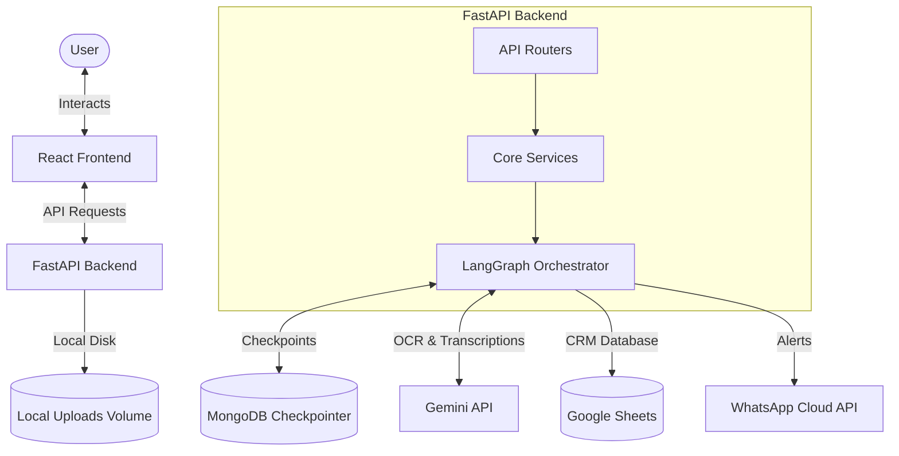
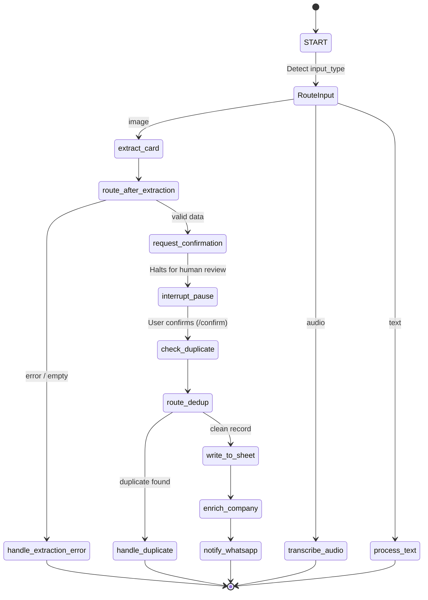

# CardFlow

A production-grade, human-in-the-loop business card digitization CRM and voice note indexing orchestrator powered by FastAPI, React, LangGraph, and Gemini.

[](https://fastapi.tiangolo.com)
[](https://reactjs.org)
[](https://github.com/langchain-ai/langgraph)
[](https://www.docker.com)
[](LICENSE)

---

## # Problem Statement
Sales representatives and relationship managers constantly receive physical business cards during conferences and meetings. Manually transcribing these details into CRMs is slow and error-prone. Additionally, capturing contextual follow-ups or voice notes right after a meeting is often lost because standard CRM systems do not support structured, voice-linked contact entries.

CardFlow solves this by providing a conversational interface that extracts business card details via vision models, deduplicates entries against existing sheets, updates details on confirmation, transcribes voice notes contextually linking them to the contact row, and automatically alerts managers on WhatsApp.

---

## # Solution Overview
1. **Business Card Upload**: The user uploads a business card image via the React chat interface.
2. **AI Extraction**: The backend passes the image to `gemini-2.5-flash` using structured generation to extract `Name`, `Phone`, `Email`, and `Company`.
3. **Human-in-the-Loop Interrupt**: The LangGraph execution halts using a native `interrupt` checkpoint. The React UI displays an editable form showing the extracted details.
4. **Deduplication Check**: Once the user reviews and confirms, the graph resumes, fetching existing rows from Google Sheets to verify that the contact is not a duplicate.
5. **Sheet Record Creation**: The contact is appended to a Google Sheet within a constrained boundary (`Sheet1!A:H`) to prevent column alignment shifts.
6. **Enrichment & Notification**: The company name is enriched (website + LinkedIn) using Gemini, and a WhatsApp notification is dispatched to the manager.
7. **Audio Voice Notes**: The user can upload or record a voice note. The orchestrator transcribes it, locates the correct row in the sheet via a live `Session ID` scan, and updates the contact row with the audio URL and transcript.

---

## # Key Engineering Highlights
* **Deterministic Workflow Design**: Utilizes a deterministic LangGraph state machine rather than an autonomous ReAct loop. This guarantees 100% execution safety, prevents tool hallucinations, and guarantees the human confirmation gate always halts execution.
* **Human-in-the-Loop Checkpoint**: Leverages LangGraph persistent checkpointing (`MongoDBSaver`) to freeze graph state during interrupt and resume execution seamlessly when the user confirms.
* **Sheets Column Constraint**: Restricts Sheets API `append` operations strictly to `"Sheet1!A:H"`. This prevents column shifting caused by empty trailing values and keeps fields perfectly aligned.
* **Deduplication Strategy**: Runs name, email, and phone validation against live spreadsheet data before performing insertions to avoid duplicate contacts.
* **WhatsApp Cloud API Alerting**: Fully integrated webhook dispatch notifying managers of newly digitized contacts in real time.
* **Object URL Memory Management**: Reclaims browser memory in React by automatically revoking local Blob URLs once unmounted or changed.

---

## # High-Level System Architecture



---

## # Detailed LangGraph Workflow



---

## # Tech Stack

| Layer | Technology | Details |
| :--- | :--- | :--- |
| **Frontend** | React, Vanilla CSS, Vite | Clean chat client, light/dark theme, stable message keys. |
| **Backend** | FastAPI, Python 3.13 | Uvicorn server, modular routing, async task handlers. |
| **AI Orchestration** | LangGraph, LangChain, Google GenAI SDK | Multi-path state orchestration, structured extraction (`gemini-2.5-flash`). |
| **Storage** | MongoDB Atlas, Google Sheets, Local Volume | MongoDB for session persistence, GSheets for CRM store, disk volume for audio uploads. |
| **Integrations** | WhatsApp Cloud API | Automated templates notifying contact updates. |
| **Infrastructure** | Docker, Docker Compose | Consistent multi-container deployment environment. |

---

## # Project Structure

```
CardFlow/
├── .env.example              # Template for system environment variables
├── docker-compose.yml        # Orchestration configuration for frontend + backend
├── backend/
│   ├── app/
│   │   ├── agent/
│   │   │   ├── checkpointer.py  # MongoDB checkpointer connection setup
│   │   │   ├── graph.py         # StateGraph topology definition
│   │   │   ├── nodes.py         # Node executors and state transitions
│   │   │   └── state.py         # AgentState Pydantic validation
│   │   ├── services/
│   │   │   ├── audio_service.py # Audio transcription service
│   │   │   ├── dedup_service.py # Contact de-duplication comparison logic
│   │   │   ├── sheets_service.py# Google Sheets API integrations (columns A-H)
│   │   │   ├── vision_service.py# Gemini structured extraction and retries
│   │   │   └── whatsapp_service.py # WhatsApp Cloud API dispatchers
│   │   ├── routers/
│   │   │   ├── chat.py          # Session messages and confirmation API routes
│   │   │   └── sessions.py      # Session CRUD routes
│   │   ├── config.py            # Pydantic-settings config classes
│   │   └── main.py              # FastAPI application initialization
│   ├── tests/                   # Suite of automated pytest test-cases
│   │   ├── test_audio.py
│   │   ├── test_core.py
│   │   ├── test_nodes.py
│   │   └── test_urls.py
│   └── Dockerfile               # Backend python container configuration
└── frontend/
    ├── src/
    │   ├── api/
    │   │   └── client.js        # API endpoints client module
    │   ├── components/
    │   │   ├── ChatWindow.jsx   # Core chat rendering, Blob URLs, and diagnostics
    │   │   ├── ConfirmationCard.jsx # Human confirmation UI form
    │   │   └── SessionSidebar.jsx # Sidebar threads tree
    │   ├── App.jsx              # Application shell
    │   └── main.jsx             # React app entry point
    └── Dockerfile               # Production static assets server (nginx)
```

---

## # Setup Instructions

### Environment Variables
Create a `.env` file in the root directory:
```bash
GOOGLE_APPLICATION_CREDENTIALS=./service-account.json
GOOGLE_SHEET_ID=your_sheet_id
MONGO_URI=mongodb+srv://...
WHATSAPP_TOKEN=your_token
WHATSAPP_PHONE_NUMBER_ID=your_number_id
MANAGER_PHONE_NUMBER=your_manager_number
GEMINI_API_KEY=your_key
ENV=development
PUBLIC_BASE_URL=http://localhost:8000
```

### Run via Docker (Recommended)
Launch the entire system inside containers:
```bash
docker compose up --build
```
* Frontend: `http://localhost:5173`
* Backend API docs: `http://localhost:8000/docs`

### Run Locally (Development)
1. **Backend**:
   ```bash
   cd backend
   python -m venv .venv
   .venv/Scripts/activate
   pip install -r requirements.txt
   uvicorn app.main:app --reload --port 8000
   ```
2. **Frontend**:
   ```bash
   cd frontend
   npm install
   npm run dev
   ```

---

## # Environment Variables

| Variable | Purpose | Required |
| :--- | :--- | :---: |
| `GOOGLE_APPLICATION_CREDENTIALS` | Path to Google Service Account JSON | Yes |
| `GOOGLE_SHEET_ID` | Identifier of Google Sheet CRM | Yes |
| `MONGO_URI` | Connection URI for MongoDB Atlas session/checkpoints | Yes |
| `WHATSAPP_TOKEN` | Bearer Token for WhatsApp Cloud API | Yes |
| `WHATSAPP_PHONE_NUMBER_ID` | Phone number ID sending alerts | Yes |
| `MANAGER_PHONE_NUMBER` | Recipient phone number for alerts | Yes |
| `GEMINI_API_KEY` | Developer key for Google Gemini model | Yes |
| `ENV` | Environment identifier (`development` or `production`) | No |
| `PUBLIC_BASE_URL` | Public-accessible server URL (blocked localhost in production) | Yes |

---

## # API Endpoints

| Method | Endpoint | Purpose |
| :--- | :--- | :--- |
| `POST` | `/api/sessions/` | Creates a new session |
| `GET` | `/api/sessions/` | Lists all sessions |
| `DELETE`| `/api/sessions/{session_id}` | Deletes a session and its checkpointer history |
| `POST` | `/api/sessions/{session_id}/messages` | Sends text, image, or audio input |
| `GET` | `/api/sessions/{session_id}/messages` | Restores message history |
| `POST` | `/api/sessions/{session_id}/confirm` | Resumes graph execution with confirmed details |
| `GET` | `/health` | Uptime check endpoint |

---

## # Human-in-the-Loop Design
Business card information extracted by OCR can frequently contain spelling errors, misread characters, or misaligned columns. Feeding unstructured data directly into a database degrades CRM data quality. 

To solve this, CardFlow implements a **Human-in-the-Loop Checkpoint** pattern. The backend interrupts execution after extraction, storing state in MongoDB. The frontend displays the details inside an interactive form, giving users the power to verify and edit data before it is appended.

---

## # Design Decisions
* **Deterministic Workflow vs. ReAct**: A deterministic state graph was intentionally selected to guarantee data integrity, enforce human confirmation, prevent tool hallucinations, and ensure predictable execution of business-critical workflows.
* **Transient API Retry**: The vision service automatically catches Gemini `429` and `503` errors, waiting `1s` before performing a single retry to safeguard operations against rate limits or temporary service degradation.
* **Environment-aware URL Validator**: The audio public URL generator allows `localhost` only when `ENV=development` is set, preserving strict external reviewer domain checks in `production`.

---

## # Reliability Features
* **Google Sheets Protection**: Restricts the bounding box of write operations to prevent cell alignment offsets.
* **Automated Deduplication**: Compares incoming email, phone, and name details against active Sheet rows.
* **Checkpointer State Sync**: Recovers complete chat structures and states even after browser tab reloads or process restarts.
* **Client-side Blob Fallbacks**: Uses browser object URLs for freshly uploaded/recorded voice notes to ensure instant clickability before backend writes finalize.

---

## # Assignment Requirement Mapping

| Requirement | Status | Implementation |
| :--- | :---: | :--- |
| **Card Data Extraction** | Implemented | `vision_service.py` extracts contact fields using structured prompt layouts. |
| **Human-in-the-Loop Confirmation** | Implemented | Interrupted execution in `nodes.py` resuming via `Command(resume=...)` inside the `/confirm` endpoint. |
| **Google Sheets Storage** | Implemented | Appends rows through `sheets_service.py` inside constrained `"Sheet1!A:H"` cells. |
| **De-duplication** | Implemented | `dedup_service.py` matches email, name, or phone values to abort writing duplicates. |
| **Voice Note Transcription** | Implemented | `audio_service.py` processes raw audio and returns English transcripts. |
| **WhatsApp Notification** | Implemented | Sends Cloud API templates inside `whatsapp_service.py`. |
| **Company Enrichment** | Implemented | Runs prompt structured search fetching company URL and LinkedIn in `enrich_company` node. |
| **Session Persistence** | Implemented | Graph states checkpointed to MongoDB Atlas database collections. |

---

